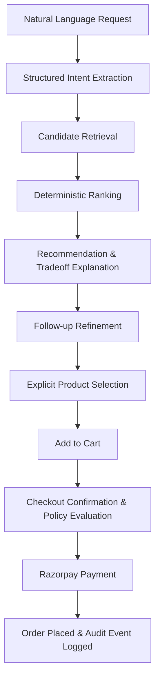
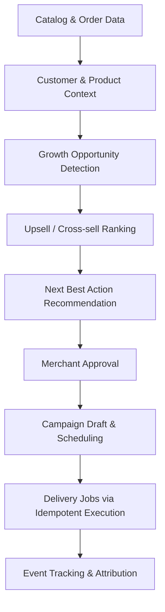
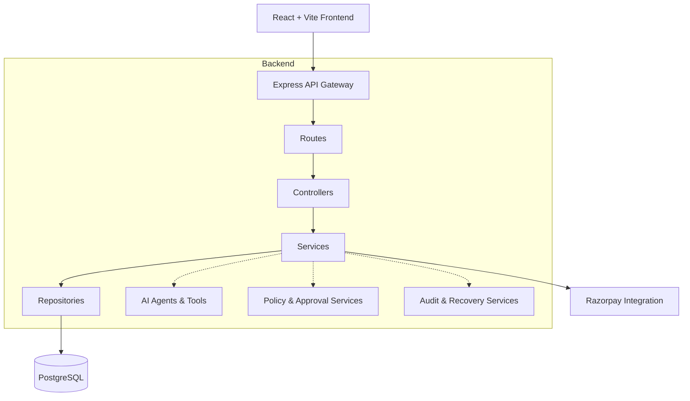

# AIsle

**AIsle** is an advanced AI-powered commerce platform that seamlessly integrates intelligent discovery and proactive merchant growth into a unified ecosystem. The platform leverages two coordinated agents—an **AI Shopping Agent** for buyers and an **AI Growth Agent** for merchants—to deliver an intuitive, intent-driven shopping experience alongside data-backed revenue generation strategies.

AIsle operates on a core architectural principle:
> **AI reasons. Ranking models score. Policies constrain. Agents act.**

By decoupling the reasoning engine from the deterministic business logic, AIsle ensures that catalog, inventory, pricing, and policy decisions are transparent, predictable, and fully controlled, while still benefiting from natural language understanding.

## Key Capabilities

- **Natural Language Commerce**: Buyers can express complex intents (e.g., "I need a lightweight laptop for coding under $1000"), and the AI Shopping Agent will extract requirements, rank available products, and explain tradeoffs.
- **Proactive Merchant Growth**: The AI Growth Agent analyzes commerce context (e.g., purchase history, cart contents) to identify high-value upsell and cross-sell opportunities, generating actionable campaigns and recommendations.
- **Guardrailed Execution**: All agent-driven actions are strictly constrained by business policies, inventory availability, and approval workflows. Agents cannot silently mutate carts or bypass checkout validation.
- **Durable Workflows**: Campaigns and recommendations are persisted as drafts, requiring explicit approval and scheduling, supported by idempotency keys to ensure safe execution.
- **Comprehensive Audit & Recovery**: Every decision made by the agents is logged for auditing, and robust recovery mechanisms are in place to handle payment failures or state inconsistencies.

## Product Flows

### Buyer Experience Flow



### Merchant Growth Flow



## Technical Architecture

The platform follows a layered, service-oriented architecture designed for scalability, maintainability, and clear separation of concerns.



- **Routes & Controllers**: Handle authenticated HTTP boundaries, request validation, and response serialization.
- **Services**: Encapsulate core business rules, orchestration, and growth logic.
- **Repositories**: Manage PostgreSQL data access.
- **Agent Tools**: Expose narrow, secure capabilities to the buyer and merchant agents.
- **Policy & Approval Services**: Constrain high-impact actions to ensure compliance and merchant control.
- **Audit & Recovery Services**: Record system decisions and gracefully handle failure paths.

## Repository Layout

```text
frontend/                  React application for buyer and merchant interfaces
backend/src/agents/        AI agents (Buyer, Merchant) and specialized tools
backend/src/services/      Core domains (Commerce, Search, Cart, Payment, Growth)
backend/src/repositories/  PostgreSQL data access layer
backend/src/policy/        Business policies and approval workflows
backend/src/audit/         Auditable agent and user decision logging
backend/src/recovery/      Resilient payment failure recovery
backend/db/migrations/     PostgreSQL schema migrations
backend/db/seeds/          Development data seeds
docs/                      Architecture, API, database, and development documentation
docker-compose.yml         Local PostgreSQL service configuration
```

## Technology Stack

- **Frontend**: React, TypeScript, Vite, Tailwind CSS, Recharts
- **Backend**: Node.js, Express, TypeScript
- **Database**: PostgreSQL
- **Infrastructure**: Docker
- **Payments**: Razorpay

## Local Development Guide

### Prerequisites

- Node.js 20 or newer
- npm 10 or newer
- Docker Desktop

### Installation

Clone the repository and install dependencies from the root:

```powershell
npm install
```

### Configuration

Copy the example environment file and configure it for your local setup:

```powershell
cp .env.example .env
```
*(By default, PostgreSQL runs on port `5432`, the backend on port `4000`, and the frontend on port `5173`.)*

For LLM-backed intent extraction, provide the `LLM_API_URL`, `LLM_API_KEY`, and `LLM_MODEL` in your `.env` file. The backend expects an OpenAI-compatible chat-completions endpoint and will gracefully fall back to local extraction if unavailable.

### Database Setup

Start the PostgreSQL container and initialize the database schema and seed data:

```powershell
docker compose up -d postgres
npm run db:migrate --workspace backend
npm run db:seed --workspace backend
```

*Note: The development seed populates the database with sample merchants, products, buyers, carts, and order history.*

### Running the Applications

**Start the Backend:**
```powershell
npm run dev --workspace backend
```
*API available at `http://localhost:4000`*

**Start the Frontend:**
```powershell
npm run dev --workspace frontend
```
*Application available at `http://localhost:5173`*

### Demo Accounts

**Merchant Accounts** (Password: `aisle_demo_merchant123`):
- `riya@stridehub.test`
- `arjun@soundnest.test`
- `neha@techcrate.test`
- `vikram@homepulse.test`
- `asha@rangrez.test`
- `meera@vastra.test`
- `kavya@rangoli.test`

**Buyer Accounts** (Password: `aisle_demo_buyer123`):
- `kabir@example.test`
- `ananya@example.test`
- `dev@example.test`

## API Reference

All protected API routes require a bearer token obtained via login.

| Domain          | Key Endpoints                                                                 |
| --------------- | ----------------------------------------------------------------------------- |
| **Auth**        | `/api/auth/register`, `/api/auth/login`, `/api/auth/me`                       |
| **Catalog**     | `/api/agent/catalog`, `/api/agent/catalog/:productId`                         |
| **Search**      | `/api/products/search`, `/api/products/search/:productId`                     |
| **Recommendations** | `POST /api/recommendations`                                               |
| **Buyer Agent** | `POST /api/agent/buyer/chat`                                                  |
| **Cart & Orders**| `/api/cart`, `/api/orders/checkout`, `/api/orders`                            |
| **Payments**    | `/api/payments/create-order`, `/api/payments/verify`, `/api/payments/failure` |
| **Merchant Agent**| `POST /api/agent/merchant/chat`                                             |
| **Growth**      | `/api/growth/opportunities`, `/api/growth/campaigns`                          |
| **Analytics**   | `/api/analytics/merchant`, `/api/analytics/buyer`                             |
| **Audit**       | `/api/audit`                                                                  |

*For comprehensive API documentation, refer to [docs/api.md](docs/api.md).*

## Code Quality and Testing

Ensure code quality and run the automated test suite:

```powershell
npm run lint
npm run typecheck
npm test --workspace backend
```

The test suite covers critical paths including search, recommendations, upsell, cross-sell, cart management, checkout, policies, payments, recovery, and analytics.

## Further Documentation

- [Architecture Overview](docs/architecture.md)
- [API Reference](docs/api.md)
- [Database & Seeds](docs/database.md)
- [Development Guide](docs/development.md)
