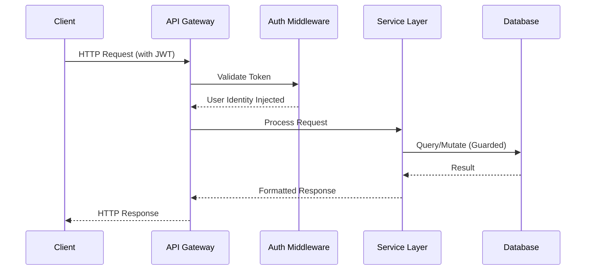

# API Reference

Base URL: `http://localhost:4000/api`. 
All protected endpoints require a Bearer token in the request header: `Authorization: Bearer <token>`.

## Request Flow



## Health and Authentication

- `GET /health`: Verify API and database connectivity.
- `POST /auth/register`: Create a new buyer or merchant account.
- `POST /auth/login`: Authenticate and return the user object along with the JWT.
- `GET /auth/me`: Retrieve the currently authenticated identity.

**Example Login Request:**

```json
{
  "email": "ada@example.com",
  "password": "password123"
}
```

## Catalog and Search

- `GET /agent/catalog`: Retrieve active, in-stock agent-readable products.
- `GET /agent/catalog/:productId`: Retrieve specific discoverable product details.
- `GET /products/search`: Perform buyer-facing catalog search.
- `GET /products/search/:productId`: Fetch specific buyer product detail.

**Search Options:**
Search endpoints flexibly support `q` (query), `category`, `minPrice`, `maxPrice`, `inStock`, `attributes`, `page`, `limit`, and `sort` (`relevance`, `price_asc`, `price_desc`).
Attributes can be passed as JSON or `key:value,key:value`. 
Search results contain deterministic `match_score` and detailed `match_reasons` objects.

## Customer Recommendations

### `POST /recommendations`

*Protected: Buyer-only*

**Request:**
```json
{
  "query": "laptop for coding around 70000 preferably lightweight",
  "maxResults": 3
}
```

**Response:**
Returns grounded product recommendations. The response contains the product details, a deterministic relevance score, confidence metric, a concise reason for the recommendation, matched requirements, matched soft preferences, and tradeoffs. Strict terms such as `under`, `below`, and `up to` enforce hard price limits. Soft terms like `around` intelligently allow a controlled 10 percent budget stretch.

## Buyer Agent

### `POST /agent/buyer/chat`

**Request:**
```json
{
  "message": "Show me a laptop for coding around 70000"
}
```

**Response:**
The response object includes the agent's `message`, current conversation `state`, retrieved `products`, actionable `actions`, and an optional cart summary. Conversational follow-ups (e.g., "upgrade", "premium", "accessories", "complete my setup") seamlessly invoke upsell or cross-sell tools behind the scenes.

**Explicit Cart Action Request:**
```json
{
  "message": "Add the first one to my cart",
  "action": {
    "type": "add_to_cart",
    "productId": "<product-id>",
    "quantity": 1
  }
}
```

## Cart, Orders, and Payment

*Protected: Buyer-only*

**Cart Endpoints:**
- `GET /cart`
- `POST /cart/items`
- `PUT /cart/items/:productId`
- `DELETE /cart/items/:productId`
- `DELETE /cart`

**Order Endpoints:**
- `POST /orders/checkout`
- `GET /orders`
- `GET /orders/:id`

The checkout process dynamically recalculates totals based on authoritative database prices, enforces row-level locks on products while validating stock, enforces a single-merchant-per-order rule, and creates a pending order transactionally.

**Payment Endpoints:**
- `POST /payments/create-order`
- `POST /payments/verify`
- `POST /payments/failure`

*Note: The frontend client cannot choose or override the authoritative payment amount. Razorpay verification is executed server-side via signatures.*

## Merchant Catalog and Analytics

*Protected: Merchant-only*

**Catalog Endpoints:**
- `GET /products`
- `POST /products`
- `PUT /products/:id`
- `DELETE /products/:id`

**Analytics Endpoints:**
- `POST /agent/merchant/chat`
- `GET /analytics/merchant`
- `GET /analytics/merchant/products`
- `GET /analytics/merchant/orders`

*Security Note: All merchant product modifications and order access are securely scoped to the authenticated merchant profile.*

## Growth Opportunities

### `GET /growth/opportunities`

Dynamically calculates and returns ranked revenue opportunities.
Returns the action type, trigger (`why now`), candidate products, customer value, business value, calculated opportunity score, confidence, reasoning, and approval requirements. 
*Optional query parameter: `productId`*

The advanced detector evaluates up to 25 merchant products per request, strictly returning only opportunities that have a highly relevant, available upsell or cross-sell candidate.

## Campaigns

*Protected: Merchant-only*

**Campaign Endpoints:**
- `GET /growth/campaigns`
- `POST /growth/campaigns`
- `POST /growth/campaigns/:id/approve`
- `POST /growth/campaigns/:id/schedule`
- `POST /growth/campaigns/:id/run`
- `POST /growth/campaigns/:id/events`

**Create a Draft Request:**
```json
{
  "name": "Laptop accessories campaign",
  "objective": "CROSS_SELL",
  "audience": {
    "purchasedCategory": "Laptops",
    "withinDays": 30
  },
  "productIds": ["<merchant-product-id>"],
  "content": {
    "headline": "Complete your setup"
  }
}
```
Campaign products must be active, strictly in stock, and owned by the merchant. All campaigns mandate explicit approval before they can be scheduled or executed.

**Run a Campaign Request:**
```json
{
  "recipients": ["<buyer-id>"]
}
```
The run endpoint generates robust, durable delivery records utilizing idempotency keys to guarantee execution safety.

**Record an Event Request:**
```json
{
  "eventType": "campaign_clicked",
  "recipientId": "<buyer-id>",
  "productId": "<product-id>",
  "metadata": {}
}
```
*Supported event types:* `campaign_delivered`, `campaign_clicked`, `campaign_converted`, `recommendation_rejected`, `upsell_accepted`, and `cross_sell_accepted`.

## Policies, Approvals, Audit, and Recovery

Buyer policy endpoints intelligently constrain purchase actions and strictly evaluate to `ALLOW`, `DENY`, or `REQUIRES_APPROVAL`. Approval endpoints guarantee safety by operating on an exact, immutable cart snapshot, including amount, currency, and expiry.

`GET /audit` returns detailed audit records explicitly scoped to the authenticated buyer or merchant. Audit entries comprehensively capture the actor, action, entity, context, decision, explanation, and precise timestamp. 

Payment recovery endpoints safely expose retryable failed-payment state, specifically engineered to prevent the creation of duplicate payment orders.
