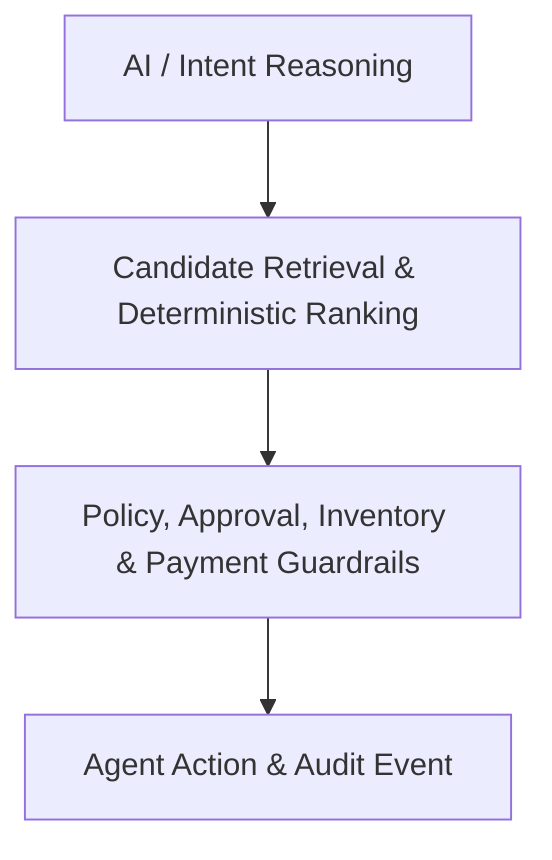
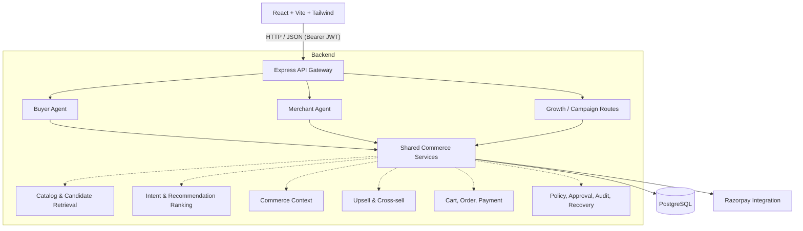
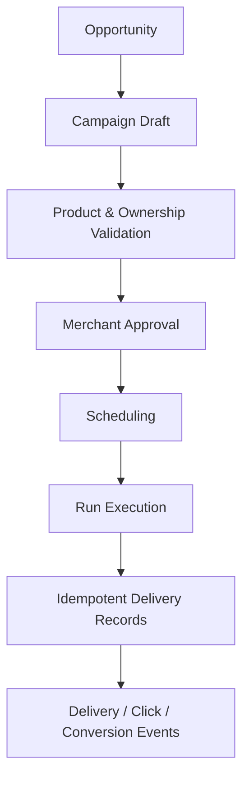

# Architecture

## System Intent

AIsle is an AI Growth and Agentic Commerce platform. It serves two roles through one commerce intelligence layer:

- **AI Shopping Agent**: Grounded product discovery, comparison, cart, checkout, and payment assistance.
- **AI Growth Agent**: Merchant product performance, upsell and cross-sell opportunities, next-best-action decisions, and campaign workflows.

The architecture strictly separates reasoning from authority, ensuring secure and predictable operations:



Agents can explain and coordinate actions, but they are not the source of truth for price, stock, identity, payment state, or authorization.

## Runtime Components



## Frontend

The frontend is a React and TypeScript application built with Vite and Tailwind CSS. React Router separates authenticated buyer and merchant experiences.

### Buyer Experience

The buyer dashboard provides a conversational shopping surface. A customer can search naturally, ask follow-up questions, view explanations, explicitly add a product to the cart, review checkout, and continue to payment. Buyer analytics, recent orders, cart state, and audit activity are shown alongside the conversation.

### Merchant Experience

The merchant dashboard provides catalog management, product status and stock visibility, analytics, recent audit activity, and a merchant assistant. Growth opportunities and campaign orchestration are available through the authenticated backend API and are documented as an API-first capability.

## Backend Layers

- **Routes** define authenticated HTTP boundaries.
- **Controllers** validate request boundaries and serialize responses.
- **Services** own business rules and orchestration.
- **Repositories** own PostgreSQL queries.
- **Agent tools** expose narrow capabilities to buyer and merchant agents.
- **Policy and approval services** constrain high-impact actions.
- **Audit and recovery services** record decisions and handle failure paths.

Important core services include `ProductSearchService`, `RecommendationService`, `ShoppingIntentService`, `CommerceContextService`, `UpsellService`, `CrossSellService`, `NextBestActionService`, `GrowthOpportunityService`, and `CampaignService`.

## Customer Recommendation Architecture

```mermaid
flowchart TD
    A[Customer Message] --> B[ShoppingIntentService]
    B --> C[ProductSearchService]
    C --> D[Candidate Set Retrieval (Max 50)]
    D --> E[Deterministic Utility Signals]
    E --> F[Top-N Response Ranking]
    F --> G[Buyer Agent Explanation]
```

Hard constraints include active status, stock, explicit search attributes, and strict price language. Soft preferences affect ranking rather than eliminating every candidate. Terms such as `around` permit a controlled budget stretch; the response explicitly exposes the budget tradeoff.

The implementation seamlessly handles candidate retrieval and ranking locally. An optional LLM can be added at the intent or explanation boundary, complete with timeout, retry, cache, and fallback behavior, while retrieval and ranking remain highly performant native code.

## Growth Architecture

### Upsell

Upsell candidates must be in stock, belong to the same category, cost more than the source product, and remain within the configured price stretch. Quality, shared use case, customer fit, and price difference contribute to the overall opportunity score.

### Cross-sell

Cross-sell candidates must be available and not already purchased. Paid order items provide frequently-bought-together signals. Compatibility, merchant attributes, shared use cases, and customer history provide additional signals.

### Next Best Action

The growth decision returns `action`, `products`, `opportunityScore`, `confidence`, `trigger`, `reason`, and `requiresApproval`. The platform intelligently returns `DO_NOTHING` when no candidate clears strict relevance and availability rules, preventing spam.

## Campaign Architecture



Campaign state is robustly persisted in PostgreSQL. The backend generates durable delivery jobs and meticulously records events for downstream attribution.

## Safety Boundaries

- Buyer and merchant roles are strictly validated on protected routes.
- Buyer cart mutations require an explicit intent and action.
- Checkout dynamically recalculates totals directly from current database prices.
- Product status and stock are strictly revalidated during checkout.
- Purchase policies can allow, deny, or require management approval.
- Payment verification securely uses server-side Razorpay webhook data and cryptographic signatures.
- Campaign products must belong to the merchant and be active and in stock.
- Audit events comprehensively record agent requests, recommendations, policy decisions, approvals, campaign decisions, and key state changes.
- Payment failure recovery safely prevents duplicate retry orders.

## Scalability Shape

Candidate retrieval and deterministic ranking avoid sending the full catalog to a model. Product intelligence is precomputed and cached, safe catalog reads are highly cached, and optional LLM calls utilize timeouts, retries, exponential backoff, and fallback responses. Campaign delivery utilizes a scalable worker queue design without mutating campaign definitions or event attribution schemas.
