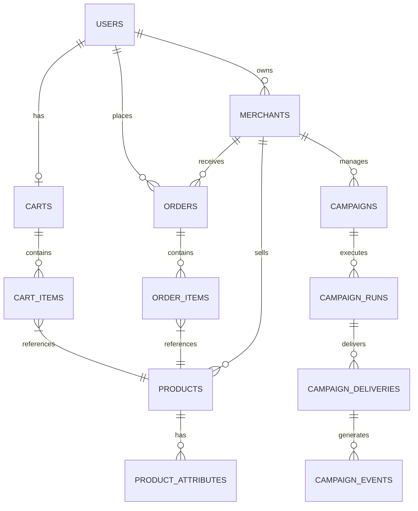
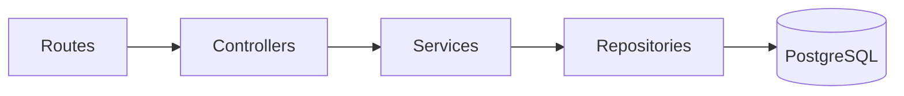

# Database and Seed Data

AIsle utilizes PostgreSQL as the robust source of truth for identity, catalog, inventory, carts, orders, payment state, policies, audits, growth campaigns, and campaign events.

## Migrations

Migrations live in `backend/db/migrations` and run in deterministic filename order:

1. `001_initial_commerce_schema.sql`: Users, merchants, products, attributes, carts, orders, and order items.
2. `002_payment_integration.sql`: Razorpay identifiers securely tied to orders.
3. `003_policy_approval.sql`: Buyer policies and explicit approval snapshots.
4. `004_audit_logs.sql`: Immutable auditable agent and user decision logs.
5. `005_growth_campaigns.sql`: Campaign drafts, runs, deliveries, and events.

Run migrations using:

```powershell
npm run db:migrate --workspace backend
```

The migration runner records applied filenames in `schema_migrations`, wrapping each file execution in an atomic transaction, safely skipping previously applied schemas.

## Seed Data

Seed files live in `backend/db/seeds` and run in filename order:

- `001_seed_commerce.sql`: Demo merchants, buyers, products, carts, attributes, and representative sample orders.
- `002_seed_large_catalog.sql`: Supplemental generation of an expanded catalog containing deterministically generated products across multiple merchants and product categories.

Run seeds using:

```powershell
npm run db:seed --workspace backend
```

The resulting development catalog contains approximately 50 to 60 products per merchant. The supplemental seed utilizes deterministic UUIDs and conflict-safe inserts (`ON CONFLICT DO NOTHING`), allowing the seed command to be safely re-run without duplicating records.

**Demo Credentials:**
- Merchant password: `aisle_demo_merchant123`
- Buyer password: `aisle_demo_buyer123`

## Core Data Relationships



## Core Tables Overview

- `users` / `merchants`: Secure buyer/merchant identity and storefront ownership.
- `products`: Merchant-owned catalog, authoritative price, currency, stock, image, and availability status.
- `product_attributes`: Flexible, key-value facts such as `brand`, `use_case`, `tier`, and `compatibility`.
- `carts` / `cart_items`: Single active transactional cart per buyer.
- `orders` / `order_items`: One-merchant checkout logic that immutably captures historical unit prices upon purchase.
- `policies` / `approvals`: Dynamic purchase limits and exact, point-in-time approval snapshots.
- `audit_logs`: Comprehensive tracking of actor, action, entity, context, decision, explanation, and precise timestamp.
- `campaigns`: Merchant campaign definition, business objective, targeted audience, featured products, content, status, and active schedule.
- `campaign_runs`: Execution attempts for approved or scheduled growth campaigns.
- `campaign_deliveries`: Recipient/product jobs featuring retry attempts and unique idempotency keys for safety.
- `campaign_events`: Detailed tracking of delivery, click, conversion, acceptance, and rejection events.

## Data Access Rules



Data access is strictly layered. Repositories utilize a shared PostgreSQL connection pool. Services are strictly responsible for enforcing role access, merchant ownership, stock validations, state machine transitions, and policy guardrails *before* repositories are invoked.
