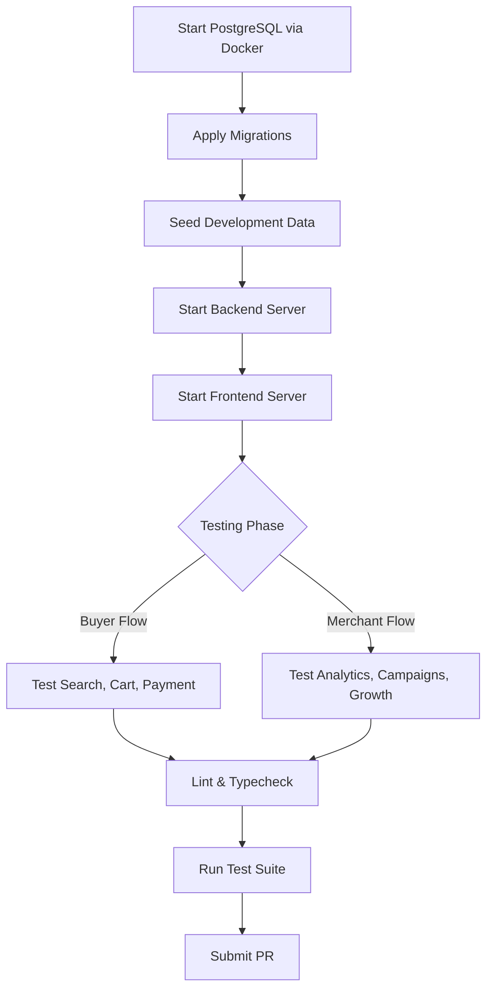

# Development Guide

## Prerequisites

- Node.js 20 or newer
- npm 10 or newer
- Docker Desktop

## Installation

From the repository root, install dependencies. The repository utilizes npm workspaces for managing the `frontend` and `backend` seamlessly.

```powershell
npm install
```

## Configure Environment

Copy the `.env.example` template to a localized `.env` file:

```powershell
Copy-Item .env.example .env
```

**Local Infrastructure Defaults:**
- **Frontend:** port `5173`
- **Backend:** port `4000`
- **PostgreSQL:** port `5432`
- **Database Name:** `aisle_dev`

*Note on Payments:* Set Razorpay test keys in your `.env` to exercise the complete checkout and payment verification flows. Do not commit real production credentials.

*Note on LLM Integration:* Optional LLM intent extraction leverages `LLM_API_URL`, `LLM_API_KEY`, and `LLM_MODEL`. The provider must return structured JSON through an OpenAI-compatible chat-completions API. The architecture is resilient: candidate retrieval and ranking execute natively in code, allowing the backend to gracefully fall back when the LLM provider is unavailable or times out.

## Local Database Lifecycle

**Start PostgreSQL:**
```powershell
docker compose up -d postgres
```

**Stop PostgreSQL:**
```powershell
docker compose stop postgres
```

**Clean Reset (Destructive):**
If you need to deliberately destroy the local database volume and start fresh:
```powershell
docker compose down -v
```

## Migrations and Seeding

Apply database schemas and populate the development environment:

```powershell
npm run db:migrate --workspace backend
npm run db:seed --workspace backend
```

Migrations and seeds are strictly ordered SQL files. The robust migration runner tracks applied files to prevent duplication. Seeds utilize conflict-safe `UPSERT` mechanisms and can be safely re-run at any time.

## Run the Applications

The backend and frontend must be run concurrently in separate terminals.

**Backend Terminal:**
```powershell
npm run dev --workspace backend
```
*Available at `http://localhost:4000/api`*

**Frontend Terminal:**
```powershell
npm run dev --workspace frontend
```
*Available at `http://localhost:5173`. The frontend automatically utilizes `VITE_API_BASE_URL` mapped to the backend port.*

## Useful Commands

```powershell
npm run build
npm run typecheck
npm run lint
npm test --workspace backend
```

## Development Workflow



## Testing Strategy

The backend test suite is built on Node's native test runner utilizing `tsx`. 
Services are fully dependency-injected, guaranteeing that complex ranking algorithms and policy guardrail behaviors can be rigorously tested in isolation without requiring a live database connection.

**Coverage Priorities:**
- Catalog transformations and strict search filters
- Structured intent parsing and soft preference evaluation
- Recommendation budget stretch logic
- Upsell threshold logic and cross-sell co-purchase ranking
- Purchased-product exclusion logic and `DO_NOTHING` termination
- Secure role isolation
- Cart integrity, checkout validation, and exact approval snapshots
- Payment signature verification and idempotent recovery
- Authoritative audit ownership

## Engineering Conventions

- **Keep Routes Thin:** Routes should only handle HTTP boundary logic.
- **Business Logic in Services:** All rules and orchestrations live strictly in the service layer.
- **Data Access in Repositories:** All SQL and data mapping are encapsulated within repositories.
- **Zero Trust:** Always utilize the authenticated identity extracted from the JWT middleware. Never trust buyer or merchant IDs passed in the request body.
- **Strict Revalidation:** Revalidate product availability, stock, and price authoritative data instantly before executing any high-impact action.
- **Agent Safety:** Keep agent tools constrained, narrow, and structurally explicit.
- **User Explanations:** Return concise, user-facing explanations directly, rather than exposing raw internal model chain-of-thought.
- **Audit Everything:** Emit permanent audit records for all high-impact agent decisions and state changes.
- **Deterministic First:** Prefer deterministic, highly-testable code for ranking, filtering, and eligibility over opaque model execution.

## Operational Boundaries

The recommendation layer intentionally retrieves candidate sets prior to ranking, bypassing the need to call an LLM for every single product in the catalog. True operational throughput will scale directly with PostgreSQL tuning, Node.js concurrency configuration, caching strategies, and specific LLM provider latency.
